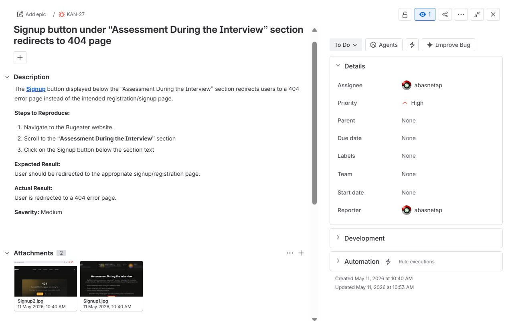
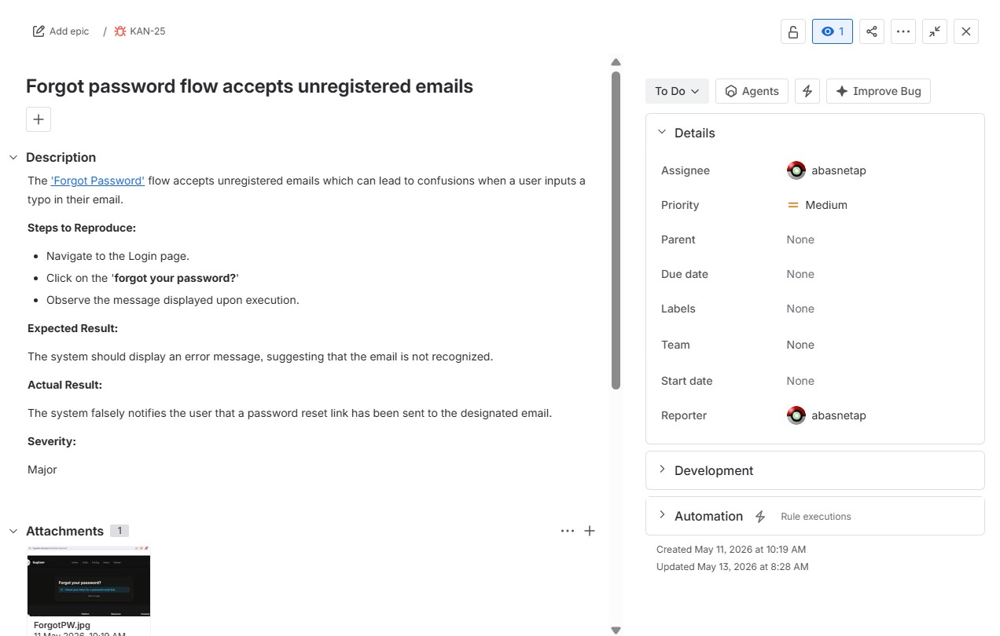
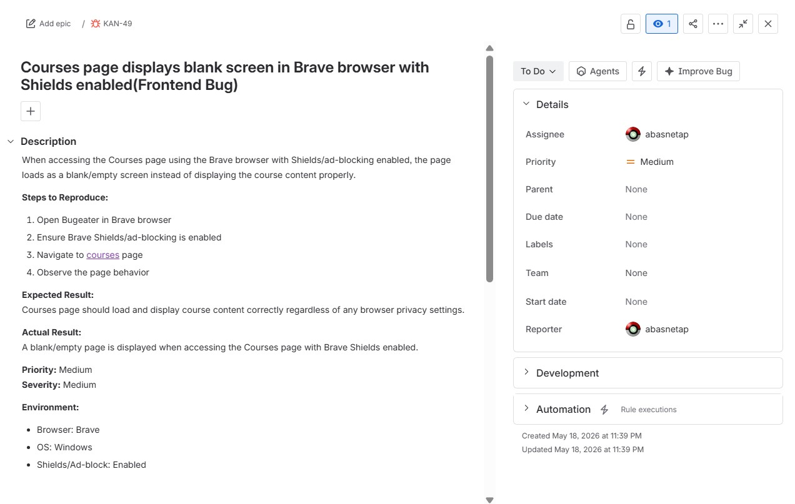

# QA Projects Portfolio – Aayush Basnet

> Cypress E2E Automation | API Testing | Performance Testing | Manual QA Documentation

---

## 🛠️ Tools & Skills

| Tool | Purpose |
|------|---------|
| Cypress | UI & E2E Test Automation (POM) |
| Postman | API Testing & Collection Management |
| JMeter | Performance & Load Testing |
| JIRA | Bug Tracking & Reporting |
| SQL | Data Validation Queries |
| Python | Scripting & Data Validation |

---

## 🤖 Automated Test Projects

### 1. Sauce Demo – E2E Automation (Cypress + POM)
**Site:** https://www.saucedemo.com/

- Full checkout flow automation using Page Object Model architecture
- Fixtures used for external test data management
- Positive and negative login scenarios covered
- Organized with `describe` blocks, `before` and `beforeEach` hooks

**Files:** `cypress/testcases/saucedemo.cy.js` · `cypress/testcases/pomcheckout.cy.js`

---

### 2. Rahul Shetty Academy – UI Automation (Cypress + POM)
**Site:** https://rahulshettyacademy.com/AutomationPractice/

- Dropdowns, checkboxes, alerts, frames, and dynamic elements
- Form validations and table data verification
- POM design pattern with modular page classes

**Files:** `cypress/testcases/rohitshetty.cy.js` · `cypress/testcases/automationexcercise.cy.js`

---

### 3. Parabank – Banking App Testing (Cypress)

- Registration, login, and transaction flow automation
- Dropdown and dynamic element handling

**Files:** `cypress/testcases/parabanktest.cy.js` · `cypress/testcases/parabankDropdowntest.cy.js`

---

### 4. Flaky Test Analysis & Stabilization
**Reference:** https://glebbahmutov.com/blog/cypress-flaky-tests-exercises/

- Identified and fixed race conditions and timing-dependent failures
- Applied `cy.intercept()`, retry-ability, and deterministic assertions

---

## 📬 API Testing – Vyaguta (Postman)

Postman collection for Vyaguta API testing included in the repo.

**File:** `Vyaguta.postman_collection.json`

- Imported directly into Postman to run all API test cases
- Covers endpoint validation, response codes, and payload assertions

---

## 📋 Test Plan – Employee Management System

Full test plan document for the EMS project at Leapfrog Technology.

**File:** `EMS_Test_Plan.docx`

- Covers Flow 1 (Create New Employee) and Flow 2 (WFH & Leave Questions)
- 46 manual test cases with steps, expected results, and status tracking
- Includes severity classification, entry/exit criteria, and risk assessment

---

## 🐛 Bug Reports (JIRA)

### Bug Report 1

### Bug Report 2

### Bug Report 3

---

## 📋 Test Plans

[📄 View EMS Test Plan](EMS_Test_Plan.docx)

---

## 📝 Test Cases

---

